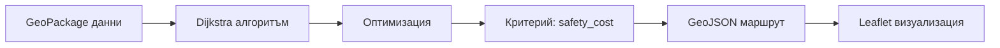

# Проект: Нощен безопасен маршрут за студенти в София

## 🎯 Проблемът
Студентите в София често се движат нощем между лекции, студентски звени и общежития. Много от пътевете му маршрути са тъмни, изолирани и безбезопасни. Този проект предлага решение чрез геопространствен анализ за намиране на оптимални маршрути със заплаха за безопасност.

## 🛠 Технологии
- **QGIS 3.34 + QNEAT3** - за алгоритъма на Dijkstra и мрежов анализ
- **PostgreSQL + PostGIS** - за съхранение и обработка на геоданни
- **Python + GeoPandas** - за автоматизиране на изчисленията
- **Leaflet.js** - интерактивна уеб визуализация
- **OSRM/GraphHopper** - за реално маршрутиране (бъдеще)

## 📊 Как се изчислява безопасността

Фактори, използвани за оценка:
| Фактор | Влияние | Източник |
|--------|---------|----------|
| Дължина на сегмента | По-дълги пътища = по-висок риск | Геометрия |
| Осветление | По-малко = висок риск | OSM street lighting |
| Обществен транспорт | Близост = По-ниски риск | Останови на СОТ |
| Интензивност нощем | По-малко движение = висок риск | Трафик данни |
| Централност | Центърът = По-добро осветление | Геометрично |

## 📁 Структура на проекта
```
├── layer.gpkg           # Геопакет със Софийската пътна мрежа
├── route.geojson        # Маршрут в GeoJSON формат
├── automation.py        # Python скрипт за обработка
├── query.sql            # SQL заявка към PostGIS
├── ragis.html           # Интерактивна уеб карта
└── safe_network.gpkg    # Обработена мрежа със safety_cost
```

## 🚀 Стартиране

### Локално стартиране (задължително за CORS)
```bash
# Python сървър
python -m http.server 8000

# След това отворете http://localhost:8000/ragis.html
```

### Инструкции
1. Кликнете върху картата за избор на **начална точка** (📍)
2. Кликнете отново за избор на **крайна точка** (🏁)
3. Маршрутът се зарежда автоматично с цветово кодиране

## 🎓 Алгоритъм



## 🔬 Бъдещи подобрения
- [ ] Интеграция с реални данни от opendata.sofia.bg
- [ ] Crime статистики население
- [ ] Разпознаване на камери/камери за видеонаблюдение
- [ ] Интеграция с OSRM API за реално маршрутиране
- [ ] Dark/Light theme на картата

## Автор
Галя Додова

